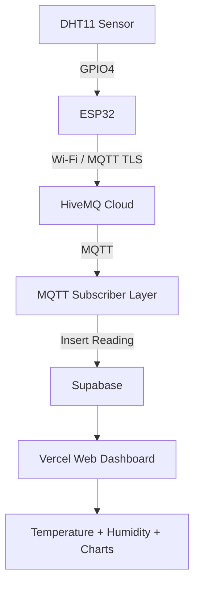

# Inventory Environmental Monitoring Module

This is the Environmental Monitoring Module for the broader Inventory Management System. It tracks live temperature and humidity in a warehouse/storage setting using an ESP32, DHT11, HiveMQ Cloud, Supabase, and a Next.js Vercel dashboard.

## Architecture



## Hardware Setup

**Components needed:**
- ESP32 Development Board
- DHT11 Temperature and Humidity Sensor
- Jumper wires

**Wiring:**
- DHT11 VCC → ESP32 3.3V
- DHT11 GND → ESP32 GND
- DHT11 DATA → ESP32 GPIO4

## Getting Started

### 1. Arduino & ESP32 Configuration
1. Connect the DHT11 to your ESP32.
2. Install Arduino IDE.
3. Install the ESP32 board package via Boards Manager.
4. Install the following libraries via Library Manager:
   - `DHT sensor library` (by Adafruit)
   - `PubSubClient`
   - `ArduinoJson`
5. Open `esp32/dht11-mqtt/dht11-mqtt.ino`.
6. Update the WiFi and HiveMQ credentials inside the sketch.
7. Upload the firmware to your ESP32.

### 2. HiveMQ Cloud Setup
1. Create a free cluster on [HiveMQ Cloud](https://console.hivemq.cloud/).
2. Navigate to "Access Management" and create a new user (username/password) for this application.
3. Take note of the Cluster URL (Host).

### 3. Supabase Setup
1. Create a new [Supabase](https://supabase.com/) project.
2. Navigate to the SQL Editor and run the SQL script found in `supabase/schema.sql`.
3. Get your Project URL, Anon Key, and Service Role Key from Project Settings > API.

### 4. Local Development (MQTT Subscriber & Web Dashboard)
Create a `.env` file in the root directory:
```env
MQTT_HOST=your-hivemq-cluster-url
MQTT_PORT=8883
MQTT_USERNAME=your_username
MQTT_PASSWORD=your_password
MQTT_TOPIC=inventory/environment/esp32-01/data

NEXT_PUBLIC_SUPABASE_URL=your-supabase-url
NEXT_PUBLIC_SUPABASE_ANON_KEY=your-supabase-anon-key
SUPABASE_SERVICE_ROLE_KEY=your-supabase-service-role-key

TEST_MODE=false
```
*(Enable `TEST_MODE=true` if you want to simulate data without the physical ESP32).*

**Run the MQTT Subscriber:**
```bash
cd mqtt
npm install
npm start
```
*(This long-running Node.js process listens to HiveMQ and pushes to Supabase. It cannot run on Vercel Serverless Functions.)*

**Run the Web Dashboard:**
```bash
cd web
npm install
npm run dev
```
Open [http://localhost:3000](http://localhost:3000) to view the dashboard.

### 5. Deployment (Vercel & Subscriber)
Because Vercel is built for Serverless (HTTP) workloads, it cannot maintain the persistent TCP connection required for the MQTT subscriber.

1. **Web Dashboard:** Deploy the `web` folder to Vercel. Ensure you add `NEXT_PUBLIC_SUPABASE_URL` and `NEXT_PUBLIC_SUPABASE_ANON_KEY` to your Vercel Environment Variables.
2. **MQTT Subscriber:** Deploy the `mqtt` folder to a persistent host (e.g., Render, Railway, AWS EC2, DigitalOcean). It needs all the environment variables from your `.env` file.

## Security Notes
- Never expose the `SUPABASE_SERVICE_ROLE_KEY` in the frontend `.env` configuration. Only the MQTT subscriber needs it.
- Use TLS (Port 8883) for all MQTT connections.
- Keep the `NEXT_PUBLIC_SUPABASE_ANON_KEY` safe; RLS policies ensure the frontend can only *read* the public sensor data.

## Future Integration
This module provides live environmental conditions (temperature and humidity). To integrate it with your broader Inventory Management System, link the `sensor_data` readings to specific storage sections or products (e.g., "Fridge A", "Warehouse Zone 2") in your overarching database schema.

